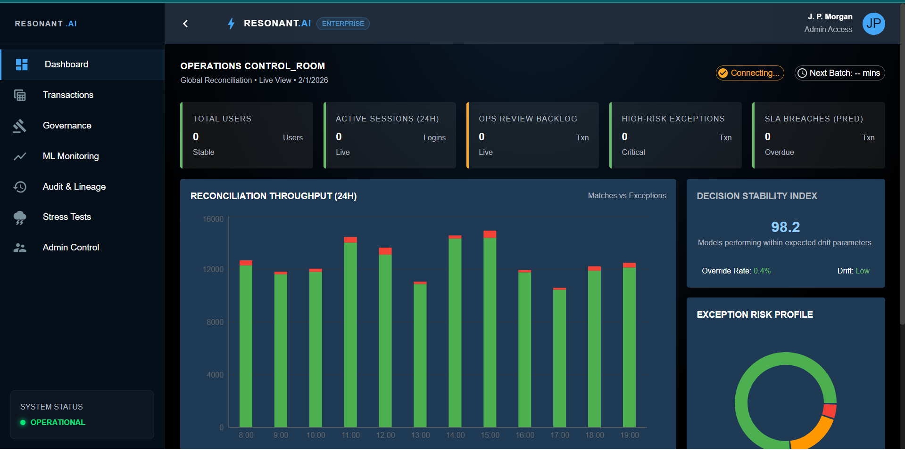
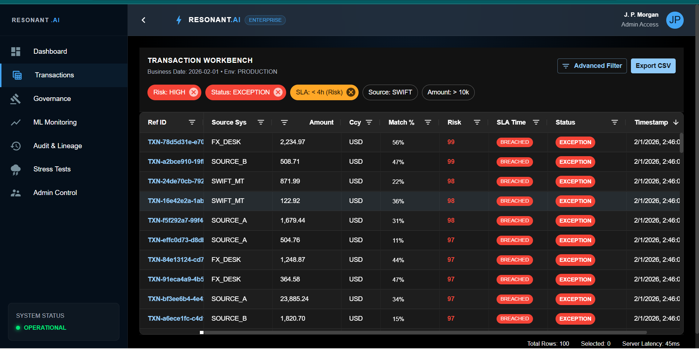
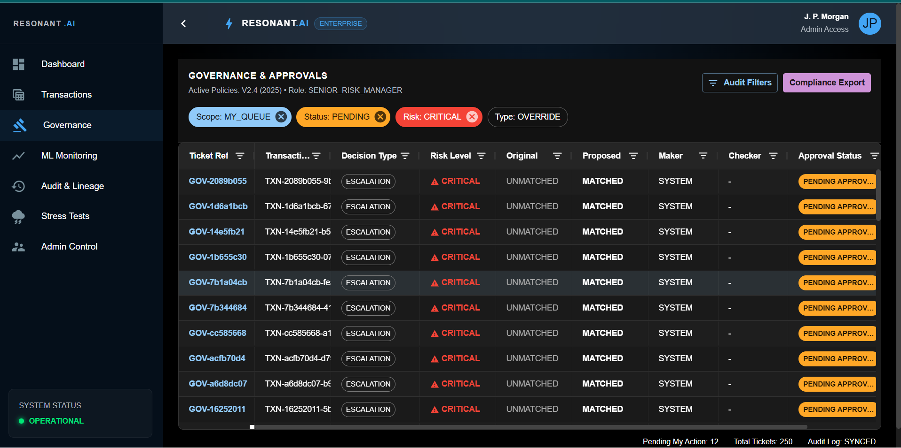
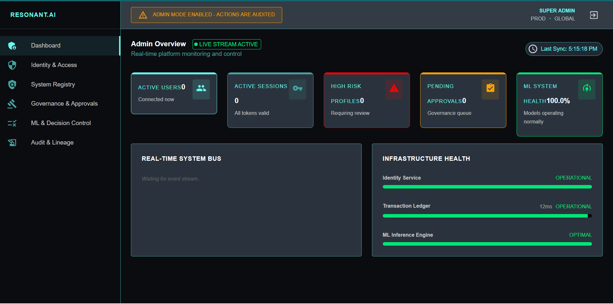
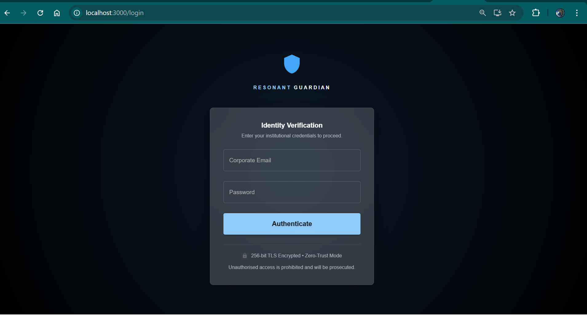

# Resonant AI - Enterprise Reconciliation Platform


**Resonant AI** is a next-generation financial reconciliation and governance platform designed for high-volume enterprise environments. It leverages advanced Machine Learning (XGBoost) for predictive matching, real-time anomaly detection, and a robust governance framework to ensure regulatory compliance.

---

## 🚀 Key Features

### 🧠 Intelligent Reconciliation
-   **ML-Driven Matching**: Utilizes `T-REC-XGB-V4.2` to predict matches with >98% accuracy.
-   **Fuzzy Logic**: Handles descriptions, OCR errors, and time-zone discrepancies.
-   **Real-time Processing**: Ingests and reconciles transactions in milliseconds.

### 🛡️ Governance & Compliance
-   **Audit Trails**: Immutable ledger of every action (Approve, Reject, Escalate).
-   **Role-Based Access**: Segregated duties for Admin, Ops, and Viewers.
-   **Four-Eyes Principle**: Mandatory review workflows for high-value exceptions.

### ⚡ Real-Time Monitoring
-   **ML Performance Tracking**: Live monitoring of model drift (PSI), confidence distribution, and anomaly trends.
-   **Operations Control Room**: Global view of break status, SLA breaches, and system health.

---

## 📸 Platform Showcase

### 1. Operations Control Room
*Real-time command center for global reconciliation operations.*


### 2. Transaction Workbench
*High-performance grid for managing exceptions and breaks.*


### 3. Deep-Dive Investigation
*AI-assisted analysis of specific transaction breaks.*


### 4. Admin Overview & System Bus
*System-wide health monitoring, user sessions, and service status.*


### 5. Secure Identity Gateway
*Resonant Guardian authentication layer.*


---

## 🛠️ Architecture

The platform is built on a modern, decoupled architecture:
-   **Frontend**: React 18 with Material UI v5 and AG Grid Enterprise.
-   **Backend**: FastAPI (Python 3.10) for high-concurrency async processing.
-   **Database**: SQLite (Dev) / PostgreSQL (Prod) with SQLAlchemy ORM.
-   **ML Engine**: Scikit-Learn pipelines + XGBoost for classification.

---

## 🚦 Getting Started

### Prerequisites
-   Node.js v18+
-   Python 3.10+

### Installation

1.  **Clone the Repository**
    ```bash
    git clone https://github.com/your-org/resonant-tyson.git
    cd resonant-tyson
    ```

2.  **Start Backend**
    ```bash
    pip install -r requirements.txt
    uvicorn app.main:app --reload
    ```

3.  **Start Frontend**
    ```bash
    cd client
    npm install
    npm start
    ```

---

## 🔒 Security
Resonant AI follows a **Zero Trust** architecture. All API endpoints require Bearer Token authentication. Admin actions are strictly audited.

---
© 2026 Resonant Financial Systems. All Rights Reserved.

